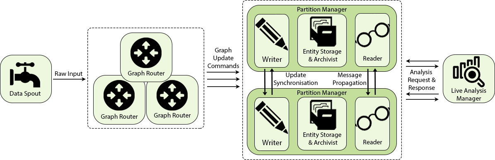
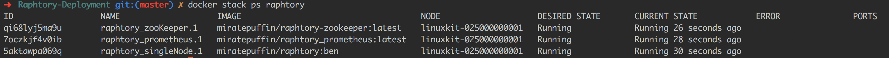
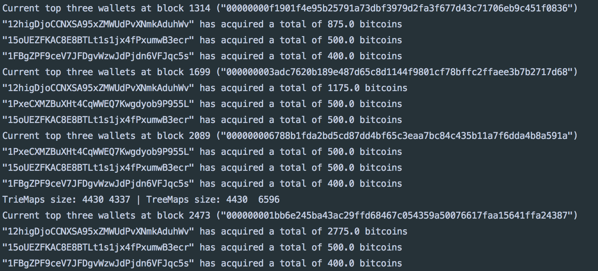
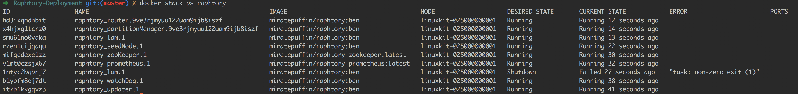
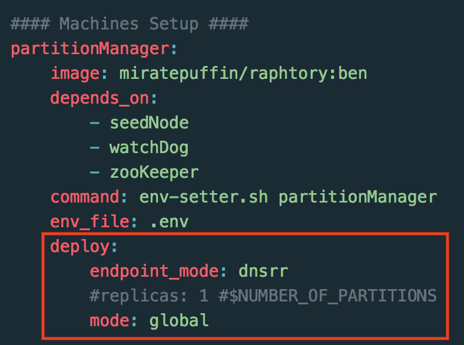

# Raphtory Introduction
Raphtory is an ongoing project to maintain and analyse temporal graphs built from event streams within a distributed environment. The most recent article on Raphtory can be found [here](https://www.sciencedirect.com/science/article/pii/S0167739X19301621). Alternatively if you cannot access this science direct version a draft PDF can be found [here](https://github.com/miratepuffin/raphtory/blob/master/Future_Generations_Computer_System_draft.pdf).

Raphtory is built around the actor model using the [Akka Framework](http://akka.io/). There are four main Actor types: [Spouts](https://github.com/miratepuffin/raphtory/blob/master/mainproject/cluster/src/main/scala/com/raphtory/core/components/Spout/SpoutTrait.scala), [Routers](https://github.com/miratepuffin/raphtory/blob/master/mainproject/cluster/src/main/scala/com/raphtory/core/components/Router/TraditionalRouter/RaphtoryRouter.scala), [Partition Managers](https://github.com/miratepuffin/raphtory/tree/master/mainproject/cluster/src/main/scala/com/raphtory/core/components/PartitionManager) and [Analysis Managers](https://github.com/miratepuffin/raphtory/tree/master/mainproject/cluster/src/main/scala/com/raphtory/core/analysis/Managers).

Spouts attach to a source in the wild such as a Kafka Stream or Rest API, ingesting this data and sending it to the Routers. Routers take this raw data from the given source and convert it to Graph updates via user defied functions. These updates may consist of adding or removing Vertices and Edges or updating their properties. Routers then send these updates to the Partition Manager responsible for the affected entities who will insert it into an ordered history. If the Partition manager is not in charge of all effected entities (such as an edge which spans between two Vertices which are stored in different partitions) it will communicate with other partitions to synchronize the update across the cluster. As Raphtory inserts updates into an ordered history, and no entities are actually deleted (just marked as deleted within their history) the order of execution does not matter. This means that Addition, Deletion and Updating are all addative opperations which can be carried out in any order and still end up with the same graph. Analysis Managers may then freely connect to the cluster at run time requesting different types of analysis to take place. 

An overview of this can be seen in the diagram below:

<p align="center">
  
</p>

## Types of analsis which can be run
#### Live View and Range
Analysis in Raphtory is split into three different types: Live, View and Range. Live Analysis runs on the most up-to-date version of the graph including all updates as they arrive. View Analysis allows the user to pick any point within the ingested history and process the graph as it looked at that exact point in time by filtering out vertices/edges which did not exist then and setting properties to the values they had at the provided time. Range Analysis expands upon views by taking a start point, end point and interval, hoping forward through time between these points, building graph views at each increment and performing the desired analysis. The output of this allows the user to see how a given property like Average Degree or Connected Components changes throughout the graphs lifetime.

#### Windowing
Raphtory also allows users to set a window time of interest so that only vertices/edges within the last hour/day/month etc. are included in the analysis, ensuring users avoid missing interesting patterns which may be prevelant in the short term, but covered up by years of older events. Windowing may be run on Live, View and Range queries and may also be done with batches of windows.  

As an example of this, below are two plots from a range query on the [GAB.AI](https://gab.ai/) graph (build from user interactions within the social network). The Analyser was looking at different features of connected components between August 2016 and May 2018, hoping forward one hour at a time. For each view the analysis was completed with windows of one year, month, week, day,and hour to see how the extracted properties would change. (This is all run in one job).

The first plot looks at the largest component size. Within this, the Month and week windows show several intersting upticks in user activity which slowly drops back down, a trend not easy to see within the year window. Similarly within the second plot, which looks at the proportion of the graph the largest component consists of, for all windows greater than an hour almost 100% of the users are connected. At the hour window, however, this varies wildy throughout the day (between 10% and 80%) as the communities go to sleep and wake back up.

  

# Running Raphtory
### To run Raphtory please refer to the [Raphtory-Deployment](https://github.com/miratepuffin/Raphtory-Deployment) repository.

To make Raphtory as easy to run as possible it has been containerised within docker. This means that you only have to [install docker](https://docs.docker.com/engine/installation/) and you will be able to run raphtory on your machine. 

First clone this project which contains all of the yml files required for running. Once this is cloned and you have docker installed, run: 

```bash
docker swarm init  
``` 

This will initialise a docker swarm cluster onto your machine which will allow you to deploy via [docker stack](https://docs.docker.com/engine/reference/commandline/stack/). Docker stack requires a [Docker Compose](https://docs.docker.com/compose/compose-file/) file to specify which containers to run, how many of each type and what ports to open etc. Within the [Raphtory-Deployment](https://github.com/miratepuffin/Raphtory-Deployment) repository there are three main compose files: One for running a Raphtory [cluster](https://github.com/miratepuffin/Raphtory-Deployment/blob/master/exampleCluster.yml), one for performing [analysis](https://github.com/miratepuffin/Raphtory-Deployment/blob/master/exampleAnalysis.yml) and a third for lanching [Prometheus](https://github.com/miratepuffin/Raphtory-Deployment/blob/master/prometheus.yml) which is the monitoring tool that Raphtory reports to. There is also a forth compose file which combines all of these into a single node for running [locally](https://github.com/miratepuffin/Raphtory-Deployment/blob/master/singlenode.yml).

## Example workloads to pick from
Once Docker is setup you may pick an example workload to experiment with. There are three to choose from (see [here](https://github.com/miratepuffin/raphtory/tree/master/mainproject/cluster/src/main/scala/com/raphtory/examples)): A 'random' graph where updates are generated at runtime; the [GAB.AI](https://gab.ai/) graph (a graph build from the posts on the social network); and a 'coingraph' built by ingesting the transactions within the bitcoin blockchain. 

Each datasource comes with a [Spout](https://github.com/miratepuffin/raphtory/blob/master/mainproject/cluster/src/main/scala/com/raphtory/core/components/Spout/SpoutTrait.scala) which generates/pulls the raw data, a [Router](https://github.com/miratepuffin/raphtory/blob/master/mainproject/cluster/src/main/scala/com/raphtory/core/components/Router/TraditionalRouter/RaphtoryRouter.scala) which parses the data into updates, and example [Analysers](https://github.com/miratepuffin/raphtory/blob/master/mainproject/cluster/src/main/scala/com/raphtory/core/analysis/API/Analyser.scala) which perform some basic processing; a selection of which can be found [here](https://github.com/miratepuffin/raphtory/tree/master/mainproject/cluster/src/main/scala/com/raphtory/core/analysis/Algorithms). Note: Both GAB and Bitcoin workloads have example data baked into Raphtory's base image, meaning you can run these without having access to the GAB rest API, or a Bitcoin full node established. 

Raphtory uses [Reflection](https://docs.scala-lang.org/overviews/reflection/overview.html) to decide what Spout/Router/Analyser to create at run time. Therefore, to choose one of these examples you do not need to rebuild the Raphtory image, only change the docker [environment file](https://docs.docker.com/compose/env-file/) (.env) which docker stack requires when running. Example .env files are available [here](https://github.com/miratepuffin/Raphtory-Deployment/tree/master/EnvExamples) for each of the workloads. 

#### For the insturctions below I shall be using the GAB data and readme example environment [file](https://github.com/miratepuffin/Raphtory-Deployment/blob/master/EnvExamples/readme_dotenv.example) which have several scripts to automate your first run of Raphtory. 
 
## Deploy locally via docker-compose
To run locally a [script](https://github.com/miratepuffin/Raphtory-Deployment/blob/master/raphtoryLocal.sh) is provided which carries out all the steps required to get our node up and running. 


If we look inside of the compose file, we will see three 'services' which this should deploy. Prometheus, which is the monitoring tool used for Raphtory. singleNode which contains all of the Raphtory components. We can check if the cluster is running via:

```bash
docker stack ps raphtory
```
which will list all of the containers running within the stack and allow you to connect to their output stream to see what is going on inside. This should look like the following: 

<p align="center">
  
</p>

We can then view the output from Raphtory running within in the single node via:

```bash
docker service logs raphtory_singleNode --follow
```  
There should then be some initial debug logs followed by the output for the analysis for the chosen workload. For example below we can see the Bitcoin Analyser returning the top three wallets which have aquired the most bitcoins at the latest ingested block. 

<p align="center">
  
</p>

In addition to these logs [Prometheus](https://prometheus.io/docs/practices/instrumentation/) is running at [http://localhost:8888](http://localhost:8888), providing additional metrics such as CPU/memory utilisation, number of vetices/edges and updates injested. 


Finally when you are happy everything is working, the cluster can be removed by running:

```bash
docker stack remove raphtory
```

## Deploy as a cluster
Deploying over a cluster is very similar to deploying locally, we again copy the env file and deploy via docker stack, but this time we use the docker-compose.yml file:

```bash
cp EnvExamples/bitcoin_read_dotenv.example .env
docker stack deploy --compose-file docker-compose.yml raphtory
```
When we look inside of this file it can be seen that there a lot more services. This is because each of the Raphtory cluster components are now within their own containers. It should be noted here that due to the random order docker starts up these containers, they can sometimes fail to connect to zookeeper and crash (see the Live analysis manager below). This is completely fine and the container will simply be restarted and connect to the cluster. 

<p align="center">
  
</p>

### Increasing the number of Routers and Partition Managers 
As you are now running in cluster mode the number of PM's and Routers within your cluster can be specified. This is set within the yml file under the 'deploy' section of each service. A nice way we have found to do this is to set the mode to global and then set a [label constraint](https://docs.docker.com/v17.09/datacenter/ucp/2.2/guides/admin/configure/add-labels-to-cluster-nodes/#apply-labels-to-a-node) for the service. This way you get one Partition on each chosen node within the swarm cluster.             

<p align="center">
  
</p>

In addition to the above, whilst Routers and Live Analysis Managers can leave and join the cluster at any time (as they are somewhat stateless), there has to be a set number of Partition Managers established at the start. This is set within the .env file under PARTITION_MIN and should match the number which will be created when the containers are deployed.
